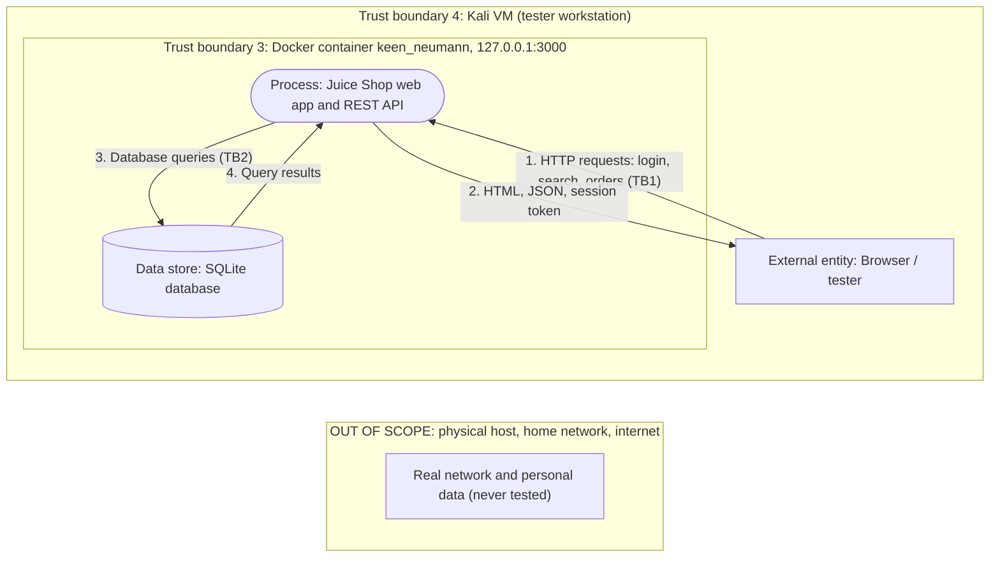

# Data-Flow Diagram

## Data flows

| ID | From | To | Data | Trust boundary crossed |
|---|---|---|---|---|
| 1 | Browser | Web app | Credentials, search terms, orders, uploads | TB1 (untrusted input enters app) |
| 2 | Web app | Browser | Pages, JSON, session token | TB1 |
| 3 | Web app | Database | Queries built from user input | TB2 |
| 4 | Database | Web app | User, product, order records | TB2 |

## Notes
- The lab is bound to 127.0.0.1, so no flow exists between the lab and the outside network.
- The red-flag point is flow 1 and flow 3: user input reaches the database.
